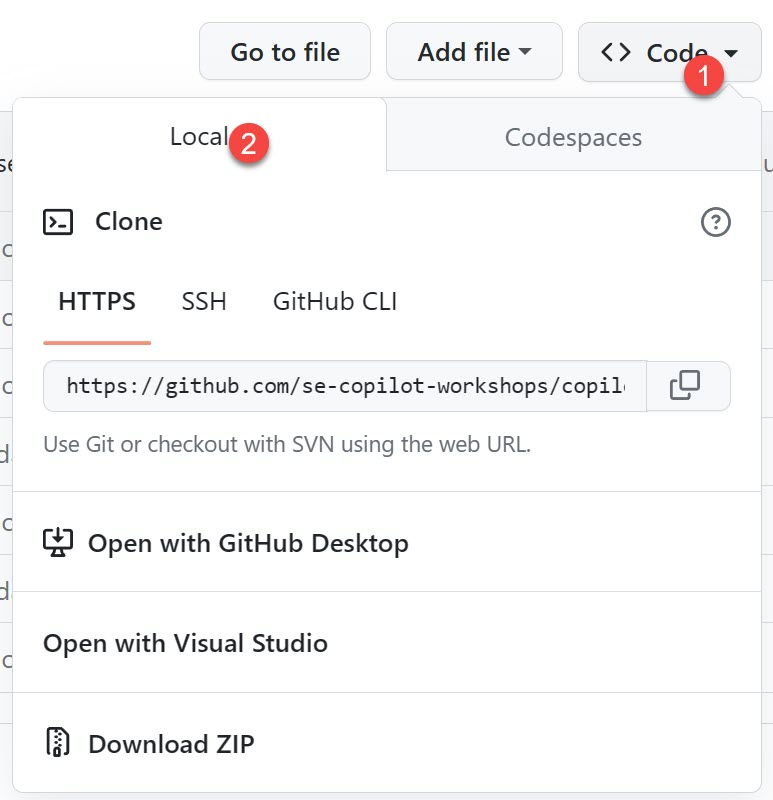
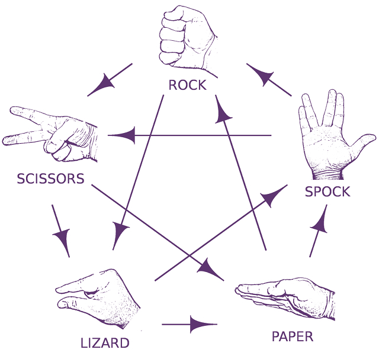

# Self-guided workshop experience

The following instructions will help you get started with GitHub Copilot. 

## Environment setup

Please read through each of the following sections to ensure your environment is setup correctly for the best GitHub Copilot workshop experience.

<details>

<summary>1. Ensuring you have access to GitHub Copilot</summary>

### Accessing GitHub Copilot

If you __DO NOT__ have one of the following:
- an active Copilot for Individuals trial
- an active Copilot for Individuals subscription
- an active Copilot for Business licence

you can sign up for a trial [here](https://github.com/github-copilot/signup).

</details>

<details>

<summary>2. Installing supporting IDE on your local machine</summary>

### Installing a supported IDE on your machine

If you __DO NOT__ have one of the following:
- VSCode
- Visual Studio
- NeoVIM
- JetBrains IDE

on your local machine, you will need to install one of these IDEs to use GitHub Copilot and complete the exercises.

If you have no preference, we suggest you install VSCode. You can download it [here](https://code.visualstudio.com/download).

</details>

<details>

<summary>3. Installing the GitHub Copilot extension</summary>

### Installing the GitHub Copilot extension

GitHub Copilot is a client-side extension you install into your supported developer IDE. The extension is available for VSCode, Visual Studio, and JetBrains IDEs.

Click the appropriate IDE link below for instructions to install the extension. As part of this you will need to log in using your GitHub account to ensure you are a licensed user of GitHub Copilot.
- [VSCode](https://docs.github.com/en/copilot/getting-started-with-github-copilot?tool=vscode#installing-the-visual-studio-code-extension)
- [Visual Studio](https://docs.github.com/en/copilot/getting-started-with-github-copilot?tool=visualstudio#installing-the-visual-studio-extension)
- [NeoVIM](https://docs.github.com/en/copilot/getting-started-with-github-copilot?tool=neovim#installing-the-neovim-extension-on-macos)
- [JetBrains IDE](https://docs.github.com/en/copilot/getting-started-with-github-copilot?tool=jetbrains#installing-the-github-copilot-extension-in-your-jetbrains-ide)

on your local machine, you will need to install one of these IDEs to use GitHub Copilot and complete the exercises.

If you have no preference, we suggest you install VSCode. You can download it [here](https://code.visualstudio.com/download).

</details>

<details>

<summary>4. Installing the CodeTour extension (VSCode ONLY)</summary>

### Installing the CodeTour extension

CodeTour is a Visual Studio Code extension, which allows you to play back guided walkthroughs of your codebases. Our GitHub Copilot workshop includes CodeTour files to help you get started. If you're not using VSCode, there are markdown files with the steps available for you to use.

1. Navigate to the [CodeTour page](https://marketplace.visualstudio.com/items?itemName=vsls-contrib.codetour) on the Visual Studio Marketplace and click **Install**.

</details>


## Workshop exercises

### Core exercise

The following exercises will help you get started with GitHub Copilot.

<details>

<summary>1. Cloning the exercise repo to your local machine</summary>

### Cloning the exercise repo

1. Navigate to the [Copilot-rock-paper-scissors repo](https://github.com/se-copilot-workshops/copilot-rock-paper-scissors) 
2. Clone this repo to your local machine using your preferred method. You can find options by clicking the Code drop down and clicking on the local tab. (NOTE: You can use Codespaces if you are familiar)



</details>

<details>

<summary>2a. Using CodeTour to start the exercise (If you installed in and are using VSCode)</summary>

### Starting the CodeTour

1. Ensure you can see the files in the **Explorer view**. If not, click the **Explorer View icon** on the left sidebar of your editor.


2. At the bottom of the Explorer view panel, click **CodeTour** to expand the CodeTour panel.


3. In the CodeTour panel, press the “**Play button**” to start the tour.


4. Your CodeTour will begin! Follow the CodeTour’s steps in the main code window to learn how to use GitHub Copilot.


5. When you've completed each step, click the **Next** button to move to the next step in the CodeTour.


6. Work your way through each of the steps in the CodeTour to complete this exercise.


</details>

-or-
<details>
<summary>2b. Using written instructions (no CodeTour)</summary>

### Step by step instructions

1. Ensure you can see the files in the **Explorer view**. If not, click the **Explorer View icon** on the left sidebar of your editor.


2. Open the ```main.py``` file if it's not already open in the editor.
3. Let's start by adding the following comment to provide some context for the code we're about to write:
```# Write a rock, paper, scissors game``` :leftwards_arrow_with_hook:

4. On the next line we're going to prompt GitHub Copilot to suggest code for us by typing the following:

```# import random module``` :leftwards_arrow_with_hook:

5. When you press **Enter** after typing the previous comment, GitHub Copilot will suggest some code for you. Select the first suggestion by pressing **TAB** then **Enter** again.


6. Now we're going to prompt GitHub Copilot to suggest code for us by typing the following:

```# define main function that handles all the logic``` :leftwards_arrow_with_hook:

7. When you press **Enter** after typing the previous comment, GitHub Copilot will again suggest some code for you. Select the first suggestion by pressing **TAB** then **Enter** again.
8. **Pause briefly** while Copilot creates up to 10 suggestions for you. You should see the Copilot icon in the lower right corner of the editor spinning. When Copilot displays the first suggestion, we're going to open the GitHub Copilot suggestion panel by pressing **CTRL + ENTER**. 
9. Scroll down the list of suggestions that GitHub Copilot has made and choose the one that looks like the best option for our Rock, Paper, Scissors game. When you see the suggestion you want, click **Accept Solution** to have that code snippet inserted into your code file.


10. On the line following the last snippet, let's prompt GitHub Copilot to suggest the final line of code for us by typing the following:

```# call main function``` :leftwards_arrow_with_hook:

11. When you press Enter after typing the previous comment, GitHub Copilot will suggest some code for you. Select the first suggestion by pressing TAB then Enter again.


**Now we're ready to see if this code executes** :thumbsup:

> **NOTE:** To run the Python code, you'll need to have Python installed on your computer.

13. In the Terminal window in your Codespace, type the following command and press **Enter** to run the code:

```python3 main.py``` :leftwards_arrow_with_hook:

Here's an example of what the completed game might look like.


---

Hopefully your Paper, Rock, Scissors game is working! Remember, GitHub Copilot is probabilistic so you may not get the exact same code suggestions as we did. If you're not happy with the suggestions, you can always press **CTRL + Z** to undo the changes and try again.

You're ready to move onto the challenge exercises below.

</details>

### Challenge exercises

Now you've had an opportunity to get started using GitHub Copilot, we have a number of challenges for you to attempt. Remember the goal here is not to test your programming abilities but rather, see how you can use GitHub Copilot to help you complete these tasks.


<details>
<summary>Challenge #1 - Adding Lizard and Spock to the game</summary>

### Adding Lizard and Spock to the game

- Improve the rock paper scissors game by adding Lizard and Spock.
**Extra Kudos** for a terminal interface that provides a list of options with keyboard input.
Eg.
```
$ Choose your option:
1.  Rock
2.  Paper
3.  Scissors
4.  Lizard
5.  Spock
```



</details>

<details>
<summary>Challenge #2 - Adding Unit Tests</summary>

### Adding Unit Tests

- Implement unit tests using pytest or any testing module of your choice.
Try to aim for 100% coverage :)

Business Logic:


</details>

<details>
<summary>Challenge #3 - Adding a REST API</summary>

### Adding a REST API

- Turn it into a REST API
E.g.  sending a POST /rock (or json payload) should return a 200 OK response with the result in the body

</details>


### What's next?

If you're participating in a mentored workshop, you may be asked to complete a brief survey to share your feedback. This is a good time to share your feedback by completing the survey.

### Additional resources

To learn more about GitHub Copilot, here are a few resources you might be interested in reviewing.

- [Setup GitHub Copilot for Business](https://www.youtube.com/watch?v=MOM0Fj5V0f0) (YouTube)
- [Benefits of Copilot for Business](https://www.youtube.com/watch?v=iWutvppVwjw) (YouTube)
- [GitHub Copilot tips and tricks](https://www.youtube.com/watch?v=1qs6QKk0DVc) (YouTube)

**Copilot X videos** (GitHub's vision for what Copilot might evolve to in the future.)

- [The Download: Everything You Need to Know About GitHub Copilot X, Generative AI Roundup and more!](https://www.youtube.com/watch?v=wNwa4GKryXI0) (YouTube)
- [Getting started with Chat](https://www.youtube.com/watch?v=3surPGP7_4o) (YouTube) 
- [GitHub Copilot: Using Voice to Code](https://www.youtube.com/watch?v=Bk7UdqoZUDk) (YouTube)

